<div align="center">
  
</div>

<div align="center">

`PLAYER 1` &nbsp;·&nbsp; Técnico em Desenvolvimento de Sistemas (ETEC) &nbsp;·&nbsp; Estudante de T.I. (Univesp) &nbsp;·&nbsp; São Paulo, SP

[](https://www.linkedin.com/in/carlos-henrique-a9aab33a7/)
[](mailto:carloscamilo20@outlook.com)
[](https://feds-lol-site2.vercel.app)

</div>

<br/>

Eu aprendo construindo. Enquanto a primeira vaga não chega, coloco projeto no ar: plataforma com banco e autenticação, bot que reage a eventos em tempo real, jogo que virou TCC com nota máxima. Cada um deles está documentado para que outra pessoa consiga entrar no código sem me perguntar nada.

<br/>

## 🏆 HIGH SCORES

| # | Projeto | Fase | Stack |
|:-:|---|---|---|
| **1** | [**Cosmic Defender Arcade**](https://github.com/VoLTz-dll/cosmic-defender-arcade) — jogo arcade no navegador com placar online e comentários gerados por IA. TCC da ETEC | 🏅 `NOTA MÁXIMA` | React 19 · TypeScript · Canvas · Web Audio · Express · SQLite · Gemini API |
| **2** | **feds.lol** — plataforma de perfis personalizáveis para comunidades gamer: giveaways, carteira virtual, console admin com permissões e auditoria · [ver no ar](https://feds-lol-site2.vercel.app) | 🟢 `EM PRODUÇÃO` | Next.js 16 · TypeScript · Tailwind · MySQL · Drizzle · Better Auth · Vitest |
| **3** | **Redylive** — transmissão de tela em grupo pelo navegador, WebRTC em malha com sinalização por WebSocket · [app desktop](https://github.com/VoLTz-dll/redylive-app) | 🔵 `CONCLUÍDO` | Next.js 16 · Fastify · WebRTC · Docker · GitHub Actions |
| **4** | **Guardian** — bot anti-raid para Discord: snapshots, rollback automático, detecção de raid por janela deslizante | 🔵 `CONCLUÍDO` | TypeScript · discord.js · Prisma · PostgreSQL · Redis |
| **5** | [**Sistema de Passagens**](https://github.com/VoLTz-dll/Sistema-Passagem-Turista) — reservas em linha de comando, modular, persistência em JSON | 🎓 `ETEC` | Python |
| **6** | [**Veterinária SQL**](https://github.com/VoLTz-dll/Veterinaria-SQL) — modelagem de banco e CRUD completo | 🎓 `ETEC` | MySQL |

<br/>

## ⚡ POWER-UPS

<table align="center">
<tr>
<th align="center">🎨 FRONT-END</th>
<th align="center">⚙️ BACK-END</th>
<th align="center">🗄️ DADOS & INFRA</th>
</tr>
<tr>
<td align="center">

<br/>
<br/>
<br/>
<br/>
<br/>


</td>
<td align="center">

<br/>
<br/>
<br/>
<br/>
<br/>


</td>
<td align="center">

<br/>
<br/>
<br/>
<br/>
<br/>


</td>
</tr>
</table>

<br/>

## 🎯 MISSÃO ATUAL

```
▶ CONSTRUINDO   feds.lol — plataforma de perfis personalizáveis, em produção
▶ ESTUDANDO     arquitetura de aplicações web · bancos relacionais · WebRTC
▶ PROCURANDO    primeira oportunidade em T.I. — estágio ou jovem aprendiz, São Paulo ou remoto
▶ DISPONÍVEL    qualquer período (curso EAD)
```

<br/>

## 📟 PAINEL

<div align="center">


</div>

<br/>

<div align="center">

`INSERT COIN TO CONTINUE` &nbsp;→&nbsp; [LinkedIn](https://www.linkedin.com/in/carlos-henrique-a9aab33a7/) · [carloscamilo20@outlook.com](mailto:carloscamilo20@outlook.com)

</div>
